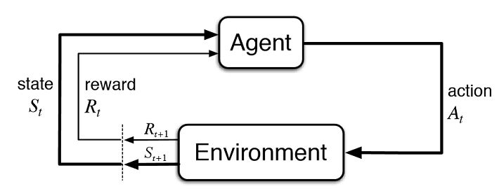
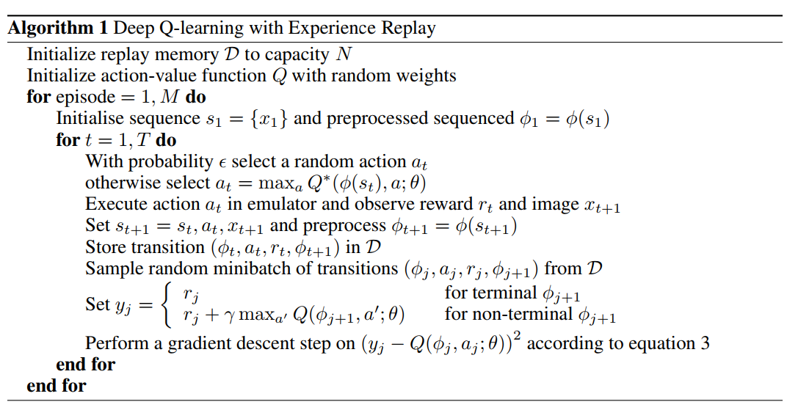
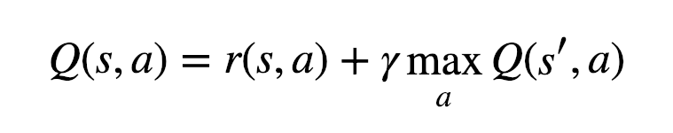

# Deep Q-Network based on Tensorflow

I implemented reinforcement learning using Tensorflow. There are currently 4 example packages, and we are still working on them.\
The following is a schematic diagram of reinforcement learning.



<br /><br />
Also, the reinforcement learning algorithm is as follows.<br />



<br /><br />
The Bellman equation to update the Q function in reinforcement learning is:<br />



## Usage

1. Inherit rl.Environment class and implement step function and reset function.

    ```python
    from rl.env import Environment
   
    class CustomEnvironment(Environment):
        def step(self, action: int) -> Tuple[np.ndarray, int, bool, Any]:
            ...
   
        def reset(self) -> np.ndarray:
            ...
    ```

2. Defines the Agent neural network model.

    ```python
    import tensorflow as tf
    
    def agent_model():
        ...
    ```

3. Create a DQN instance and env, train it by calling the method 'fit'.

    ```python
    env = CustomEnvironment(init_state=...)
    
    dqn = DQN(
        env=env,
        model=agent_model(),
        replay_buffer_size=replay_buffer_size)
    dqn.fit(
        episodes=1000,
        batch_size=32)
    ```

4. Optionally, it can be applied by implementing the 'on_episode_end' function and the 'on_step_end' function.

    ```python
    def on_episode_end(episode, reward, info):
        ...
   
    def on_step_end(state, action, reward, next_state, done, info):
        ...
    
    dqn.fit(
        episodes=1000,
        batch_size=32
        on_episode_end=on_episode_end,
        on_step_end=on_step_end)
    ```

5. Finally, when training is finished, we save the model.

    ```python
    dqn.save("model.h5")
    ```

## Example

### CartPole

#### Train
    ```shell script
    python cartpole/main.py
    ```

### Grid World

#### Train
    ```shell script
    python grid_world/main.py
    ```

### Tic Tac Toe

#### Train
    ```shell script
    python tictactoe/main.py
    ```

### Gomoku

#### Train
    ```shell script
    python gomoku/main.py
    ```